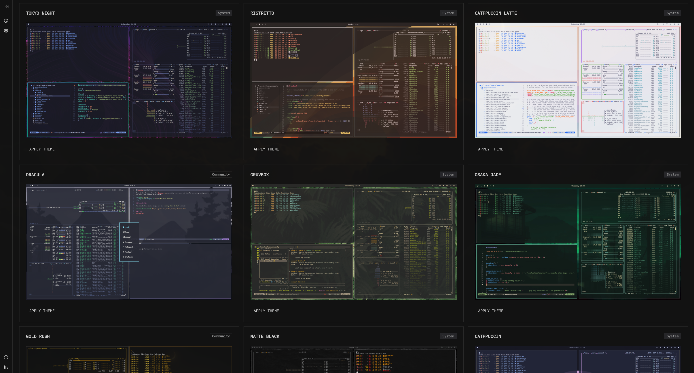
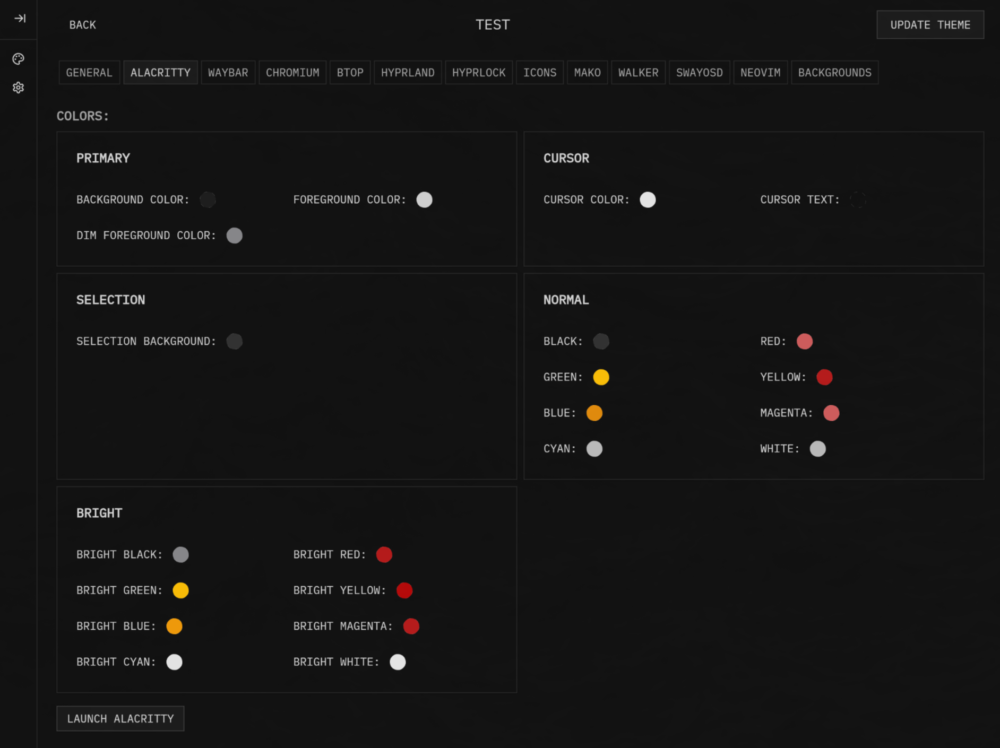

# Omarchist

**A GUI app for [Omarchy](https://omarchy.org). Powered by Tauri / Rust / Svelte.**

If Omarchy is the "omakase" meal by a Michelin star chef, Omarchist is the gelato you grab after, on the way home.

Omarchist brings Omarchy theme creation into the visual realm. Design, preview, and fine-tune your themes with color pickers, easy updates, and an intuitive interface that makes customization effortless.



## Install

```bash
yay -S omarchist-bin
```

## Features

- **Theme Designer:** Visual editor for creating and editing Omarchy themes.



## Roadmap

- [x] **Launch apps and test notifications:** Launch apps and test notifications from within the app
- [ ] **Expanded theme design options:** Add more options for styling different apps (currently supports basic options)
- [ ] **Config Management:** Edit and generate configs for Waybar, Omarchy, and other applications

## Contributing

I welcome contributions!

### Development Setup

1. **Prerequisites:**
   Check the [Tauri Documentation](https://v2.tauri.app/start/prerequisites/)

2. **Clone and setup:**

   ```bash
   git clone https://github.com/tahayvr/omarchist.git
   cd omarchist
   npm install
   ```

3. **Development commands:**

   ```bash
   # Run in development mode
   npm run tauri dev

   # Build for production
   npm run tauri build

   # Run frontend only (for UI development)
   npm run dev
   ```

## Acknowledgements

- Thanks [@dhh](https://github.com/dhh) for Omarchy.

## License

MIT
