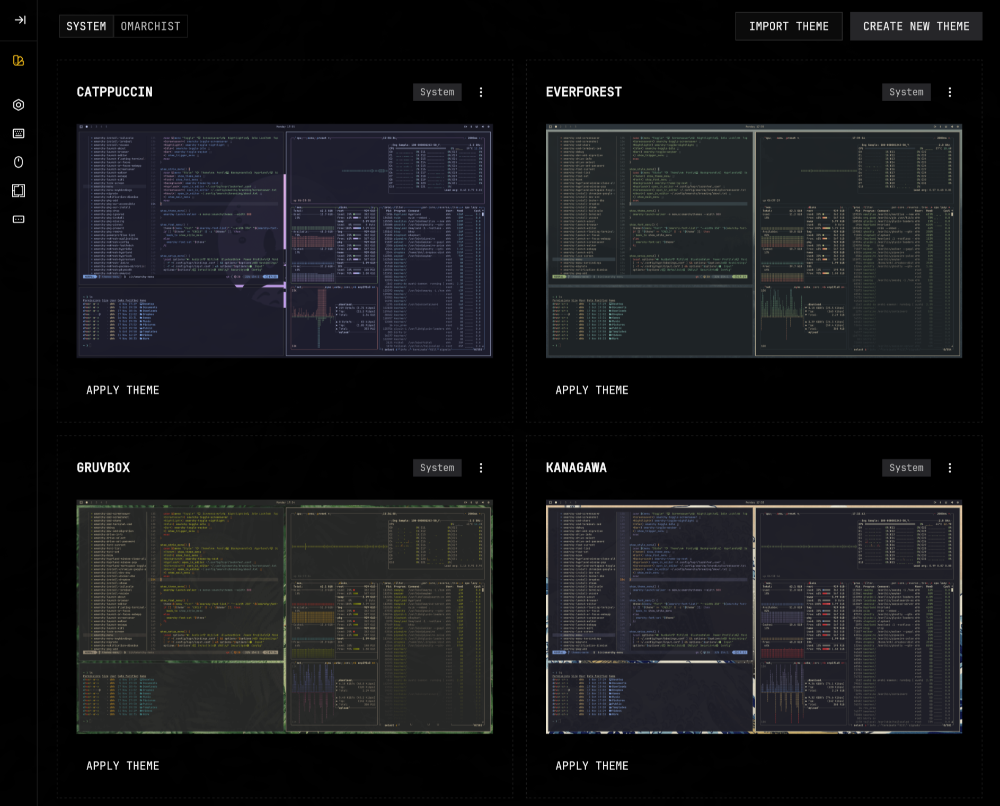
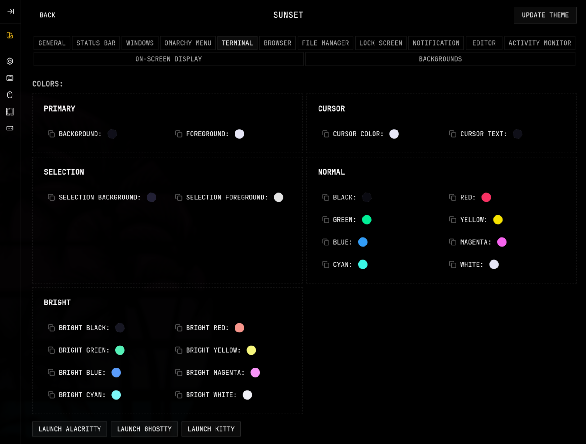
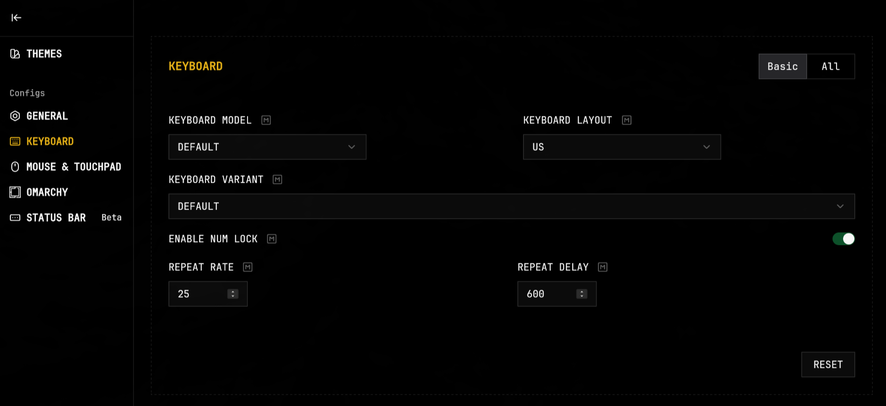
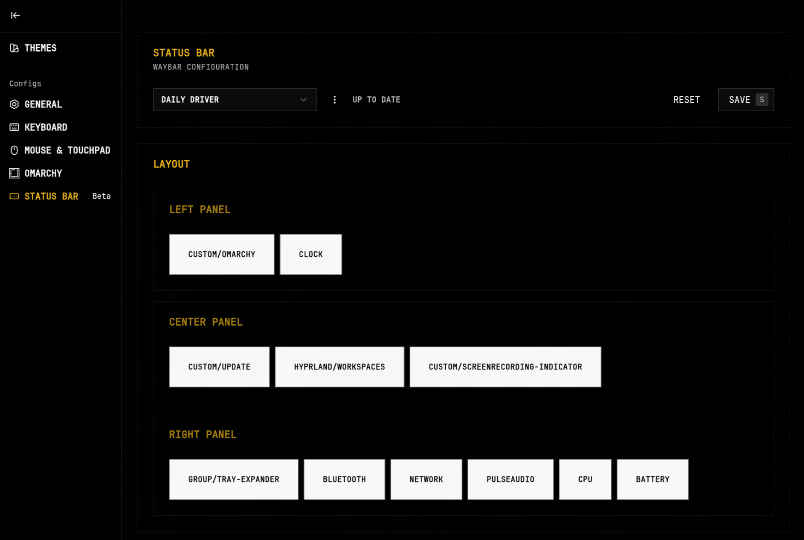

<div align="center">


<h1>OMARCHIST</h1>
<p>A GUI app for <a href="https://omarchy.org"> Omarchy</a>. Powered by Tauri / Rust / Svelte.</p>
</div>

If Omarchy is the "omakase" meal by a Michelin star chef, Omarchist is the gelato you grab on the way home.

Omarchist brings Omarchy theme creation and system configuration into the GUI realm.



## Install

```bash
yay -S omarchist-bin
```

## Features

### **Theme Designer:**

Design, preview, and fine-tune your themes with color pickers, easy updates, and an intuitive interface that makes customization effortless.

  

### **Config Management:**

Edit and generate configs for Waybar, Omarchy, Hyprland, etc (WIP).

  
  
  

## Roadmap

- [x] **Launch apps and test notifications:** Launch apps and test notifications from within the app
- [x] **Expanded theme design options:** Add more options for styling different apps
- [ ] **Config Management:** Edit and generate configs for Waybar, Omarchy, and other applications

## Acknowledgements

- Thanks [@dhh](https://github.com/dhh) for Omarchy.

## License

MIT
