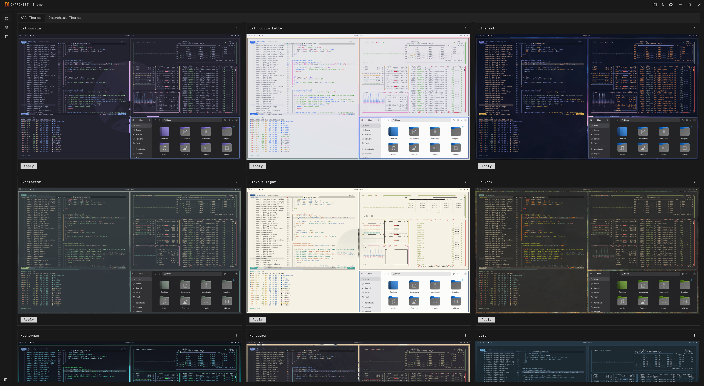
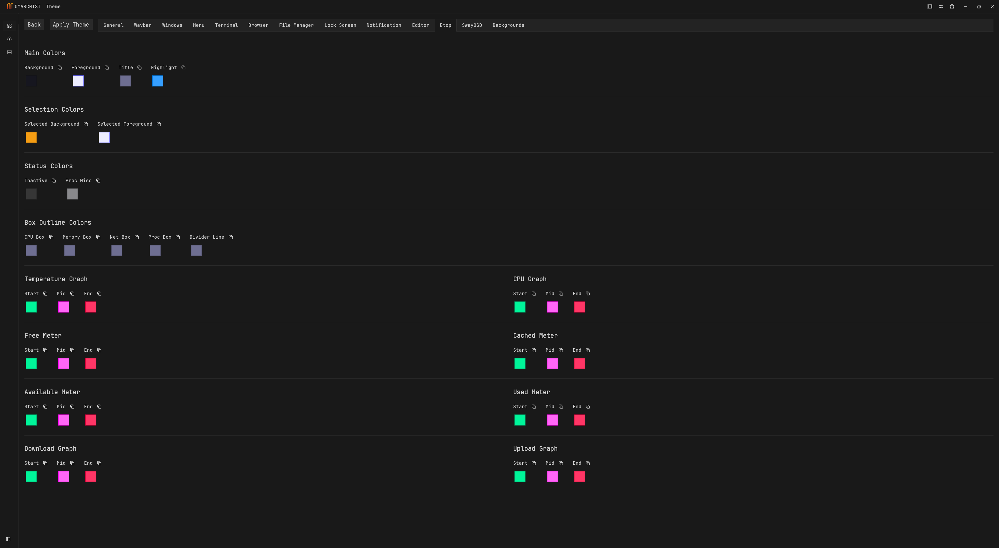
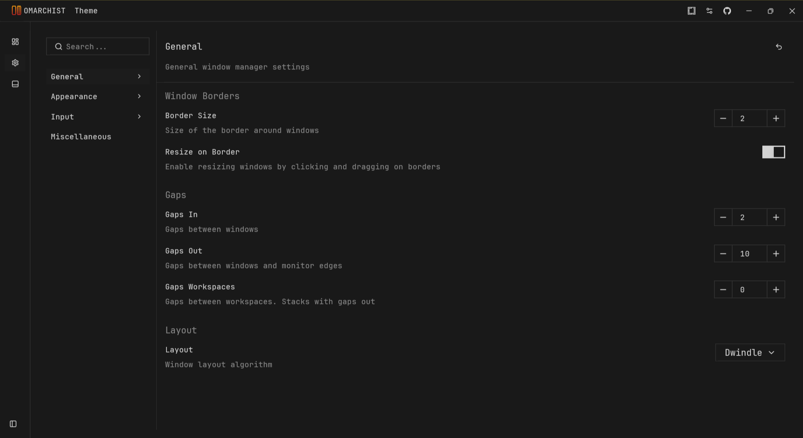
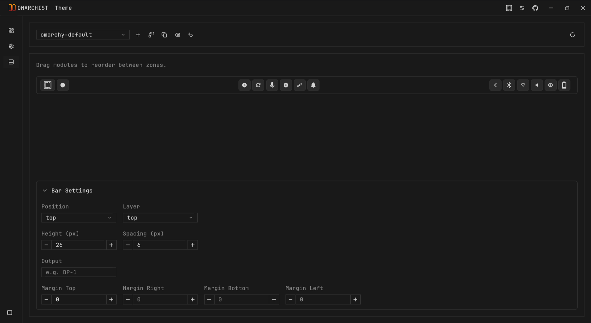

<div align="center">


<h1>OMARCHIST</h1>
<p>A GUI app for <a href="https://omarchy.org"> Omarchy</a>. Powered by Rust.</p>
</div>

Omarchist brings Omarchy theme creation and system configuration into the GUI realm.
Think of it as an optional add-on.



## Install

```bash
yay -S omarchist-bin
```

> [!NOTE]
> This goes without saying: Omarchist only works on Omarchy Linux. duh

> [!NOTE]
> Omarchist is still in early development, so expect some rough edges and missing features.

## Features

### **Theme Designer:**

Design, preview, and fine-tune your themes with color pickers, easy updates, and an intuitive interface that makes customization effortless.

  

### **Config Management:**

Edit and generate configs for Waybar, Omarchy, Hyprland, etc (WIP).

  
  
  

> [!IMPORTANT]
> Omarchist puts your current waybar config in `~/.config/omarchist/waybar/original-backup/` for safekeeping. You can restore it anytime from the app.

## Acknowledgements

- Thanks [@dhh](https://github.com/dhh) for Omarchy.

## License

Apache-2.0
