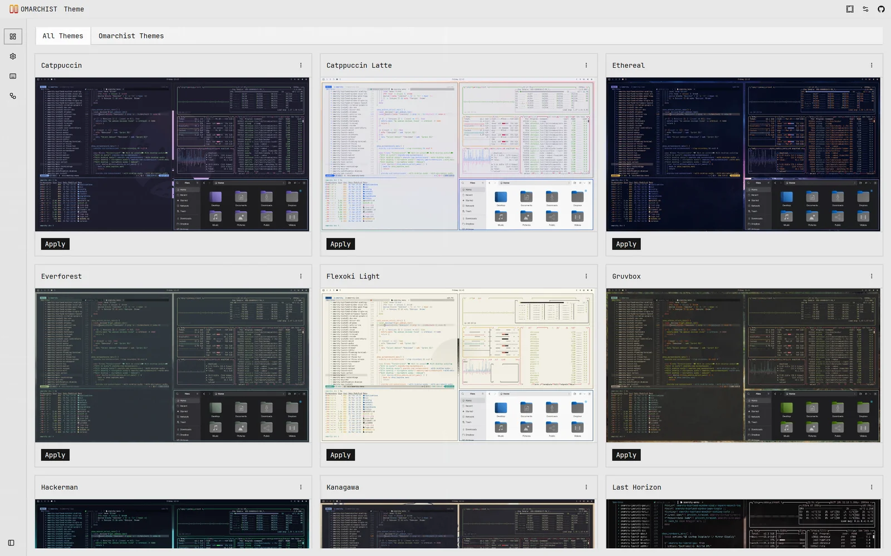
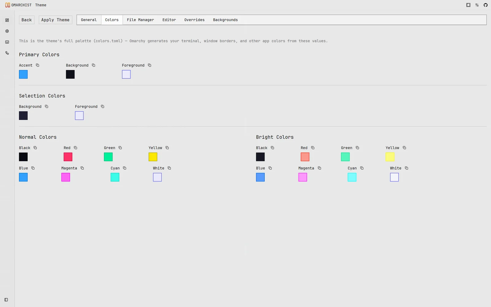
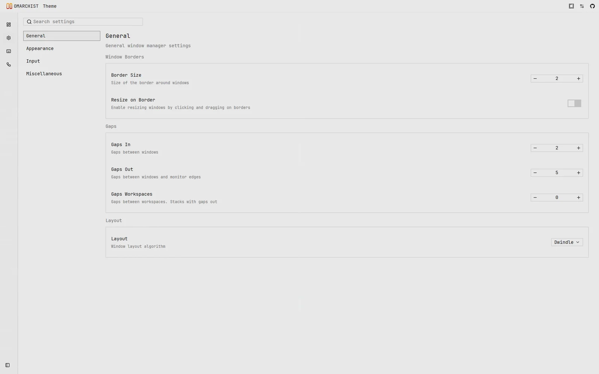
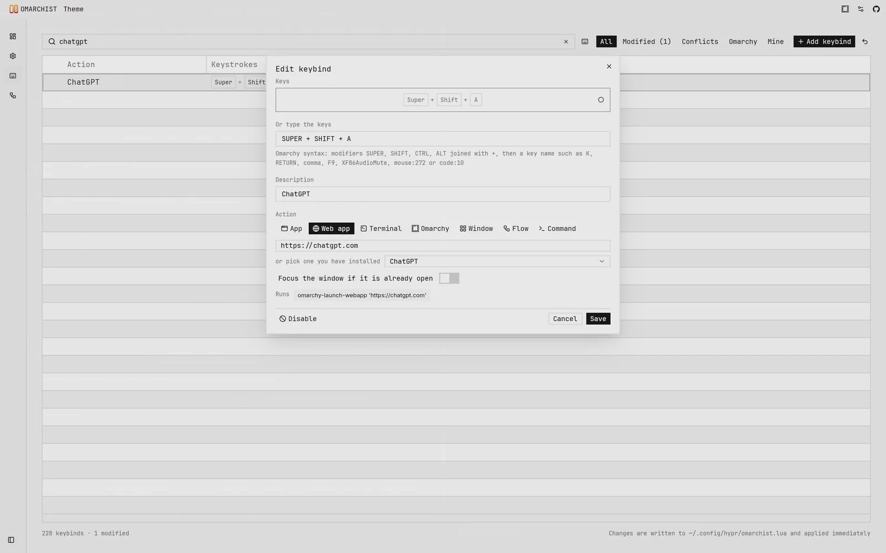
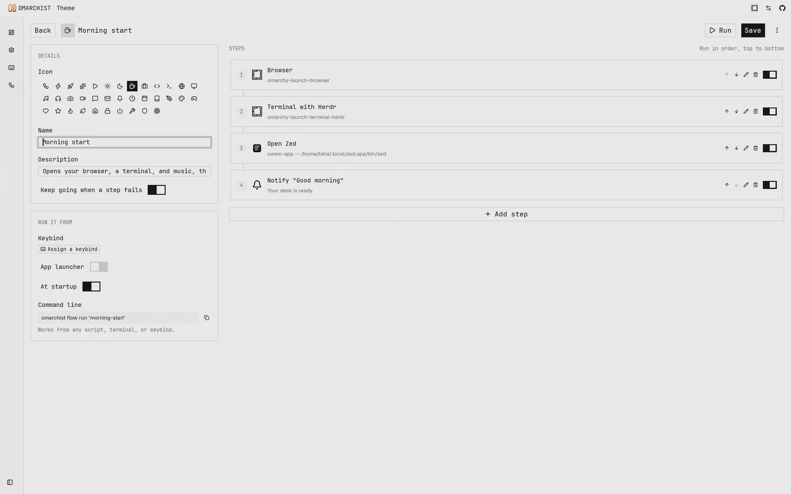

<div align="center">


<h1>OMARCHIST</h1>
<p>A GUI app for <a href="https://omarchy.org">Omarchy</a>. Powered by Rust.</p>
</div>

Omarchist brings Omarchy theming and system configuration into a window: design themes, tune Hyprland, change keybinds, and chain actions into flows, without editing config files by hand. Think of it as an optional add-on.

<picture>
  <source media="(prefers-color-scheme: dark)" srcset="screenshots/themes-dark.webp">
  
</picture>

## Install

```bash
yay -S omarchist-bin
```

> [!NOTE]
> Omarchist only works on Omarchy Linux. Version 2.x targets Omarchy Quattro (v4); for Omarchy 3.x use an Omarchist 1.x release.

Docs: [omarchist.com/docs](https://omarchist.com/docs/)

## Features

### Theme Designer

Create a theme from scratch or from an image. Omarchist writes `colors.toml`; Omarchy generates your terminals, borders, bar, and editor themes from it.

<picture>
  <source media="(prefers-color-scheme: dark)" srcset="screenshots/designer-colors-dark.webp">
  
</picture>

### Configuration

Gaps, borders, blur, keyboard, mouse, and touchpad, applied as you change them. Omarchist writes its values to `~/.config/hypr/omarchist.lua`, so your `hyprland.lua` stays yours.

<picture>
  <source media="(prefers-color-scheme: dark)" srcset="screenshots/config-dark.webp">
  
</picture>

### Keybinds

Search and change every Hyprland keybind on your system. Record a combination the way you would in an editor, or type it in Omarchy's syntax for keys the compositor keeps to itself. Your `bindings.lua` is never touched.

<picture>
  <source media="(prefers-color-scheme: dark)" srcset="screenshots/keybind-dialog-dark.webp">
  
</picture>

### Flows

String actions together, like Shortcuts on a Mac: open apps, switch workspaces, wait, notify. Run a flow from a keybind, the app launcher, at startup, or anywhere with `omarchist flow run <name>`. Start from a template, and share flows as `.flow.toml` files.

<picture>
  <source media="(prefers-color-scheme: dark)" srcset="screenshots/flow-editor-dark.webp">
  
</picture>

### Keyboard first

Every page, dialog, and control works without a mouse. `Ctrl+/` lists every shortcut and `Ctrl+Shift+P` opens a command palette.

## Acknowledgements

- Thanks [@dhh](https://github.com/dhh) for Omarchy.

## License

Apache-2.0
