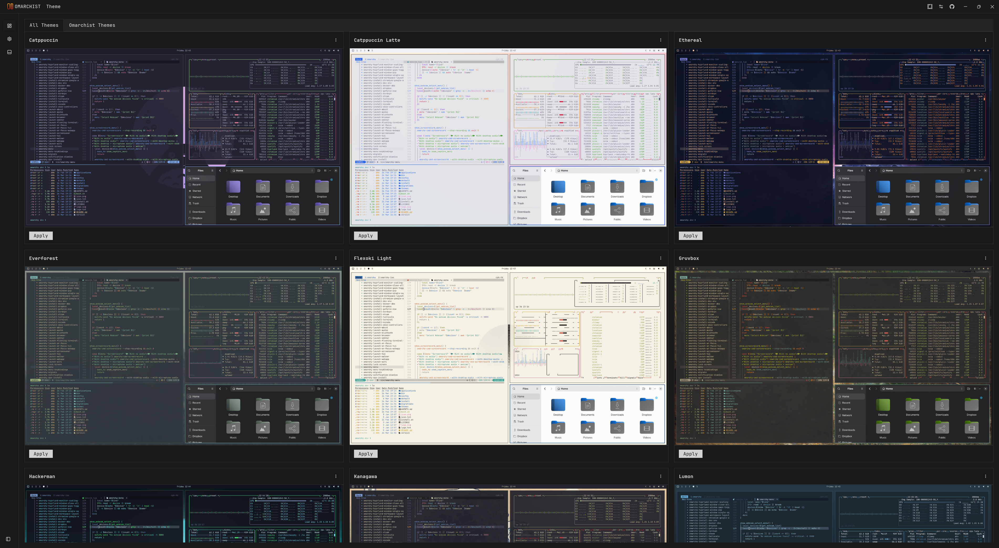
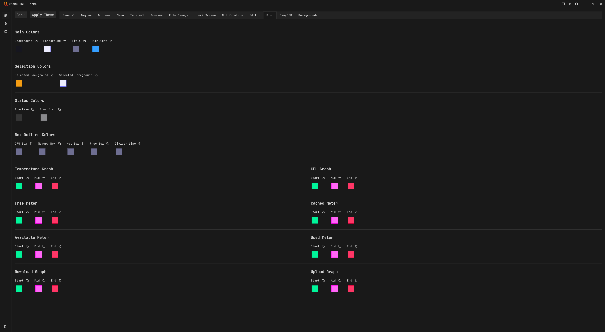
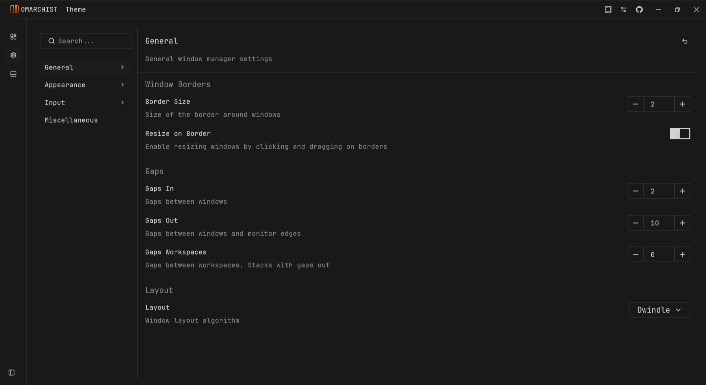
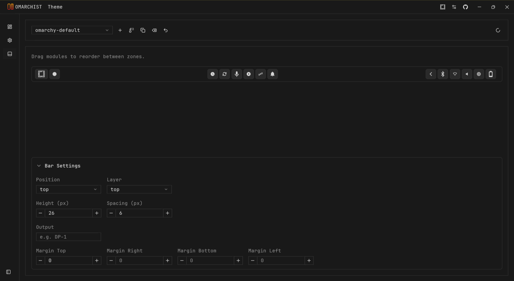

<div align="center">


<h1>OMARCHIST</h1>
<p>A GUI app for <a href="https://omarchy.org"> Omarchy</a>. Powered by Rust.</p>
</div>

Omarchist brings Omarchy theme creation and system configuration into the GUI realm.
Think of it as an optional add-on.



## Install

```bash
yay -S omarchist-bin
```

> [!NOTE]
> This goes without saying: Omarchist only works on Omarchy Linux. duh
> Version 2.x targets Omarchy Quattro (v4). For Omarchy 3.x use an Omarchist 1.x release.

> [!NOTE]
> Omarchist is still in early development, so expect some rough edges and missing features.

## Features

### **Theme Designer:**

Design, preview, and fine-tune your themes with color pickers, easy updates, and an intuitive interface that makes customization effortless.

  

### **Config Management:**

Edit Hyprland settings from a GUI. Omarchist keeps its own settings in `~/.config/omarchist/` and writes them to `~/.config/hypr/omarchist.lua`, so your `hyprland.lua` stays yours.

  
  
  

### **Keybinds:**

Browse, search, and change every Hyprland keybind on your system. Record a new key combination the way you would in an editor, or type it in Omarchy's syntax for keys the compositor keeps to itself. Changes go to `~/.config/hypr/omarchist.lua`; your `bindings.lua` is never touched.

### **Flows:**

String actions together, like Shortcuts on a Mac: open apps, switch workspaces, wait, notify. Run a flow from a keybind, the app launcher, at startup, or from anywhere with `omarchist flow run <name>`. Each flow is one JSON file in `~/.config/omarchist/flows/`.

### **Keyboard first:**

Every page, dialog, and control works without a mouse: Tab walks the controls, arrows move inside lists and grids, `Ctrl+/` shows every shortcut, and `Ctrl+Shift+P` opens a command palette.

## Acknowledgements

- Thanks [@dhh](https://github.com/dhh) for Omarchy.

## License

Apache-2.0
